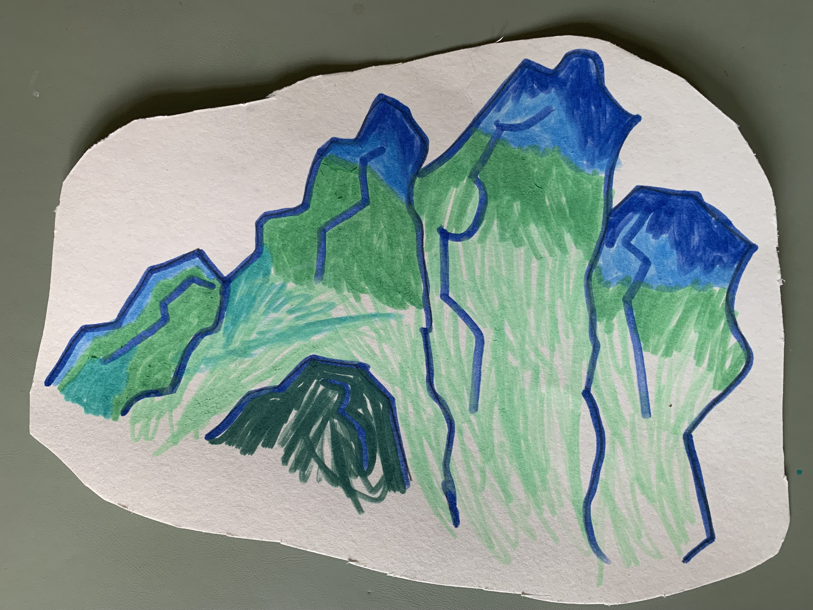
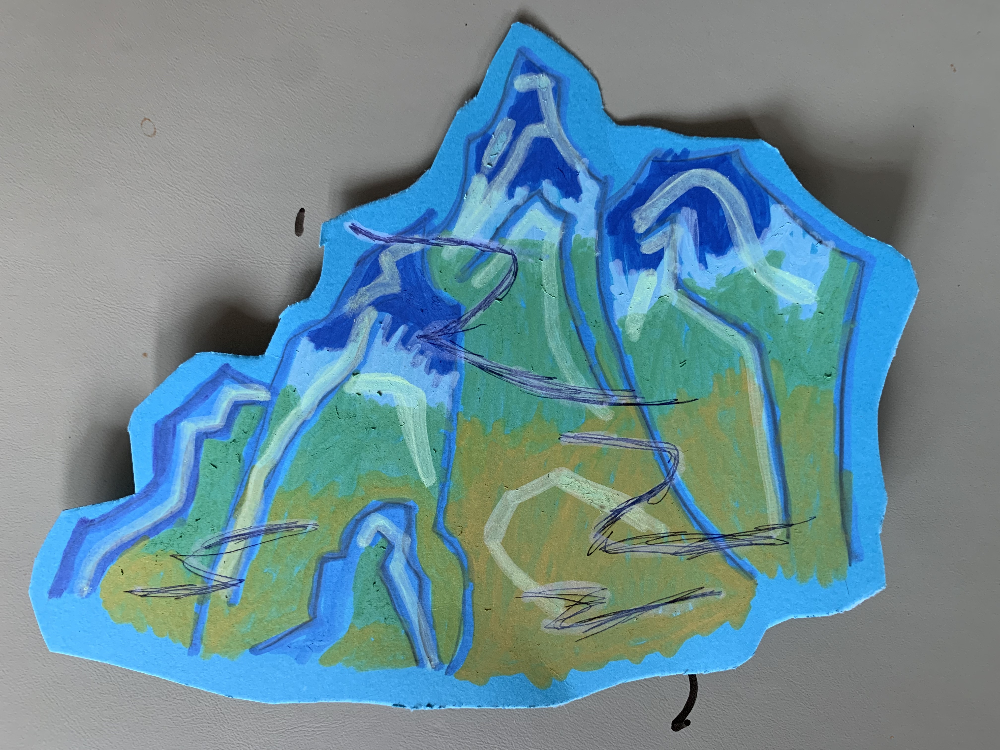
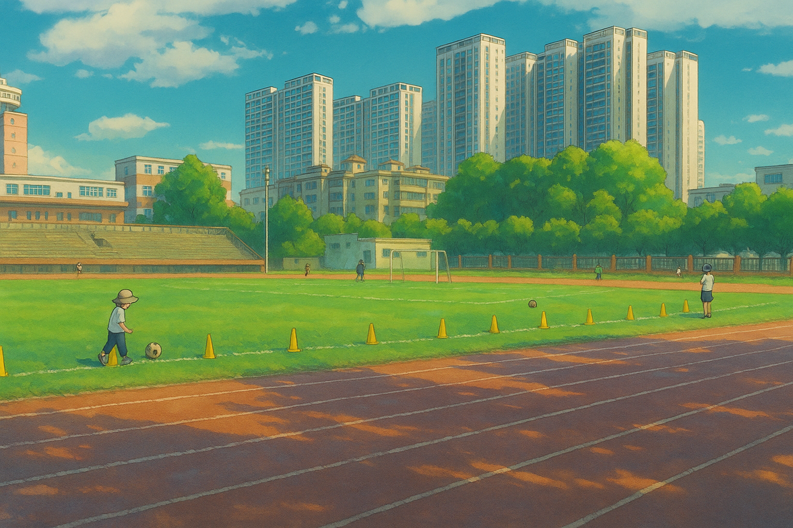

<!--
title: 千里江山图
datetime: 2025-07-07 09:15:00
licence: CC BY-NC-ND 4.0
-->

毕业季到了，孩子的学校还有两周才放假。只是随着附近小朋友们陆续休假，他辅导班的英语课，因人数不足而停课了。本着白天上学、晚上辅导的作息安排，以及 “学游泳要趁早”的理念；同时也计划着把课程都集中在月初，以便月末能出去旅游。孩子妈在收到英语停课通知后，立即为他报了当晚的游泳班——无缝衔接、绝无浪费的完美计划。

晚上回来，妻子给我描述着上课发生的一切：水池水温略低，在盛夏倒也凉爽。浅水区的水对他还是深了些，需踮起脚尖再仰头，才能勉强保持嘴巴在水面之上，旁边稍有动静掀起水波，水就可能灌入他口中。快到下课时，突然嘴里进水，一时紧张失去平衡，呛了好几口水，爷爷看到未及脱衣就从岸边跳下。老师也从远处冲来。

孩子只对我说不想学了。我劝他：“万事开头难，你第一天只是在熟悉水感，坚持下，迈过这个坎儿或许就有奇迹发生。你回头再看，就觉得 so easy。你想想你骑自行车的过程，是不是突然就会了，你甚至不知道怎么学会的。”又许愿每日去游泳馆路上可以吃一个冰激淋（平时很少给他吃冷饮），才算勉强答应。

结果晚上睡得不安稳，哭着坐起来数次，梦中还念叨“不去游泳”。第二天下午放学回家吃了点东西就吐了，晚上低烧。遂请假在家。我和妻子都隐隐有些懊悔，该不该给他报游泳课，该不该说服他坚持？

好在娃精神状态和日常无异，我下班回家，奶奶说孩子中午也不睡觉，或在桌角跪坐，或趴伏在地，两个小时，聚精会神，汗流浃背，画了两幅画。孩子则马上兴奋地给我展示他的新作——《千里江山图》

我看后挺震惊的，虽然我不懂美术，但如此用色，我做不到。他最近听着《上下五千年》刚到两宋，参观了《久仰了苏东坡》，听过我讲“诸事皆能，独不能为君”的宋徽宗，以及天才少年王希孟。在美术课上也学过用纸巾晕染的方法表现《千里江山图》的局部。这些所见所闻，让他在家便凭着印象画开了。

到此我释然了许多，很多事情毋需强求，就像种子会自己找到缝隙生长。我们殷切地希望他在一方小小的泳池里站稳脚跟，可忽略了，当他在冰凉的水中踮着脚尖，努力仰头寻找空气的时候，他的心里，或许驰骋的是“千里江山”。那画作，就像孩子给我们俩一个无意的回答。或许我们真正要做的，不是催促他游向对岸，而是给他一张更大的画纸。我们经历过被独木桥支配的岁月，更应该告诉孩子生活或许更像阿甘口中的巧克力，你永远不知道下一颗是什么味道。而他的口袋里，可能早就放好了自己喜欢的那几颗。我们需要给予他拆开包装的自由和勇气。让他选择向阳而生，并且也能接受一切。

对了，游泳呢？明年再战吧。游泳可以暂停，但是成长不会停止。后来啊，到周末了，在家里读读英语，线上找外教聊聊天。在操场晒晒太阳，踢踢球。眼前最重要的是，他说想要画折扇上的《清明上河图》，作为艺术门外汉的我，得去研究下画卷中的小故事了，我俩一起去关注下那些小贩、船工、旅人、官吏等近千人的百态人生。

