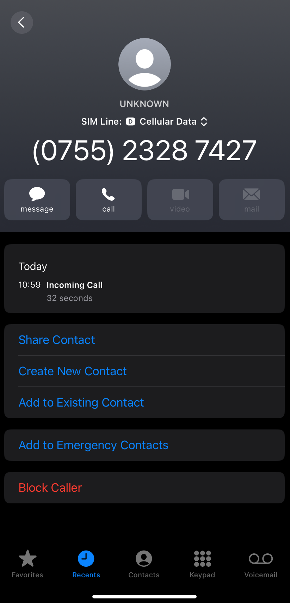

<!--
title: 原来我们都一样
datetime: 2025-07-12 22:19:50
licence: CC BY-NC-ND 4.0
-->

近来，一直在为孩子寻找合适的线上外教平台。之前的小班课受其他同学出勤影响较大，随着他即将升入小学，旧的教学方式已不太适用。因此，转为线上授课，无论在时间安排还是专注度上，都到了一个合适的节点。打算未来几个月线上线下并行，让他过渡一段时日。当然，在起步阶段，我和妻子需要全程陪伴。

试听了若干家平台，孩子的配合度很高，对各种口音并没有明显偏好。我问他喜欢哪个老师，他却懂事地说：“爸爸，咱报个便宜的吧。”

我问为什么。

他说：“咱家的钱够我上几次课的？”

我回答：“只要你愿意，够你上所有的课。”

他想了想：“那我一天上八百节课也够吗？”

我笑着说：“够的。”顿了顿，“现在不考虑费用问题，你喜欢哪个老师呢？”

他说：“都行。”

或许对孩子来说，真没什么大的不同。就如同日常户外活动，无论去公园还是在院子，他都能玩得很开心。一直在纠结、患得患失的，往往是我们大人。这事，还是我来决定吧。各平台、老师各有利弊，只能选最合适自己的。至于如何选择，我心中大略已有答案。

日常生活中，我接到陌生电话从不主动搭话。对方若不说明来意，我便挂断；若自报家门却与我无关，也会一言不发地挂断。整个过程通常不超过十秒。在这个个人隐私如同废纸的环境，如此态度也属无奈，并非恶意，只是觉得时间宝贵，不容浪费。

刚刚，接到一个陌生来电。对方自称是斑马英语的老师，问我是否有兴趣试听，声音甜美，礼貌热情。我从未预约过该平台的课程，最近也只在几个主流平台的官方渠道留过电话。且不论信息是如何泄露出去的，单就近来与各平台老师有过不少的真诚交流，让我对这个群体多了几分耐心。

于是，我耐着性子解释：“你好，我并未预约过贵平台，而且目前已经有了目标机构，孩子最早也要一个月后才会确定此事。”

我把该传递的信息都清晰地表达完毕，准备迎接那句礼貌的“好的，打扰了”，然后互道再见，给这次通话画上一个句号。

然后，空气就安静了。我没再说话，对方也不言语。电话那头，能隐约听到其他销售热情高涨的通话声。大概十秒，或许更久，就在我以为网络出了问题时，“嘟，嘟，嘟”三声忙音，对方就这么挂了电话。

干净。利落。生硬。

我愣在原地，有些发懵，随即不禁失笑。心底冒出一句：苍天饶过谁。这挂断电话的风格，不正是平日的我吗？

回头想想，原来我们都一样。我接到陌生电话，会下意识地在十秒内做出决断，然后立刻把被分散的注意力拽回工作中。而她，也在用类似的策略衡量我这个潜在客户的价值，然后毫不犹豫地拨通下一个号码。我们都惜时如金，在确认对方于自己确无价值时，果断放弃，不愿再多投入一秒的精力。

此事之后，我对待陌生电话的策略依旧不会改变。但再次挂断那些电话时，心境或许会多一丝了然。我们都在用个人的方式，挤出那为数不多的时间，留给自己。

当然，还有另一件事：斑马英语已经在我的黑名单里了。我对一个人或一家企业的信任，往往只有一次。通过买卖信息的方式来获客，实属心术不正，不值得有任何业务往来。

