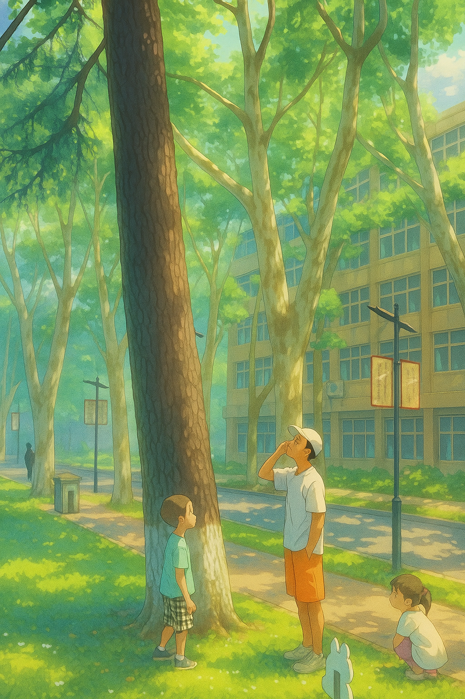
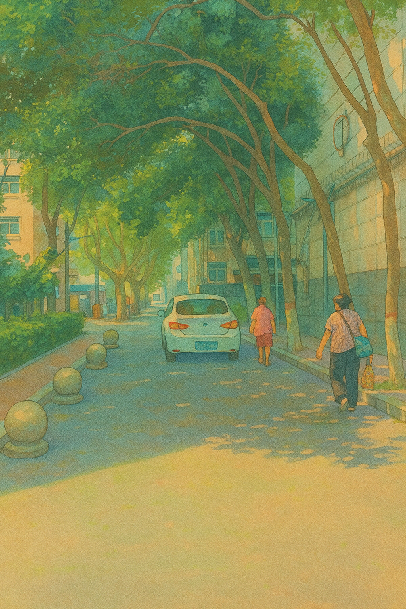

<!--
datetime: 2025-07-12 20:19:00
title: 去过暑假吧
-->

孩子的暑假开始了，先要去姑姑家与姐姐玩两周，姑父今天会来接他们。

说来也奇怪，他假期总是早早醒来，睡不了懒觉。这上学和上班如此相似，周内醒不来，周末睡不久。起床后时间利用还算有效，日常英语打卡，上外教课，户外活动。出门还偶遇体育陈老师，又带着抓知了、毛毛虫、摘桑叶、爬树，疯玩了半天。

前几天已规划且明确，今天他要离开我们生活一段时间，潜意识里想要多陪陪娃。习惯上还是日常思维：时间尚早，让孩子先自己玩一会，我做做我的事情。然而时间真切的体感流失，似乎是非线性的。仿佛趁你不注意，一下子就跳过去一大块。

吃过饭，猛看到家人开始收拾东西，方意识到，到了要走的时间了。而我，好像还没和他再说点什么。

孩子或许没啥感觉，看到姐姐也来接他，雀跃不已。走之前我也没想到我会叮嘱起那些“无用”的话：“去了要听话。去一个陌生的环境，不要乱跑。不要去隐秘的地方玩，就在人眼可见的大道上玩。小心井盖...”曾以为，自己一辈子也不会趴在车窗外讲这些话。

独自回到家，发现空荡荡，乱糟糟的，那些灰尘也似乎突然长大。边打扫，收拢了他刚玩过的战场：床头的刀剑，床边的健身球，散落地板的模型零件，桌上七零八落的粘土手作，还有从我这借走的小匣子里，藏着他这几天挚爱的一枚小骰子，他总为掷出六点而惊呼...

打扫完，一看时间，也就只过去了十一分钟。十一分钟不知道他走到哪了？一路平安。

坐在桌前，终于可以更专注自己地事情了，但此刻竟也与往常无异。

他在家时，会不时跑过来找我，或问些问题，或兴奋地展示某玩具的新发现。之后，又轻轻带上门跑开。一会又来，如此反复。只是随着年岁的见长，这种“打扰”变得少了起来。

此刻，他不在身边，却以另一种方式在“打扰”着我的思绪。

不无预感，以后前者的“打扰”会日渐稀少，而后者的“打扰”恐会越发的多。

孩子，暑假快乐，平安开心，慢慢长大。

