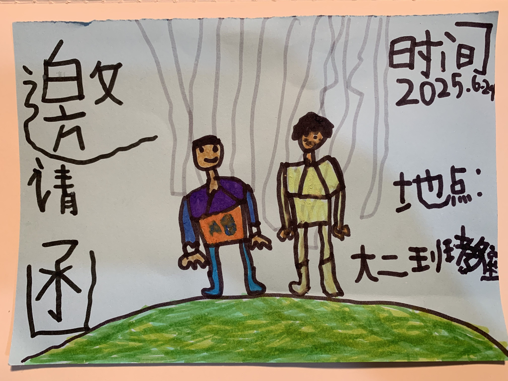

<!-- 
datetime: 2025-07-01 13:11:00
title: 幼儿园毕业典礼
-->

今天参加了孩子的毕业典礼——幼儿园毕业典礼。

事先询问过老师，说最多来两位家长，人多怕教室站不下。我和妻子便都请假同往。到了门口，却被门卫阻拦：“一张邀请函只限一位家长进入。”

妻子拿着孩子手绘的邀请函走在前面，我若无其事地紧随人群，终究还是被识破。幸好这些年脸皮厚了不少，面不改色地解释：“孩子手绘的，不知道丢哪里去了。”（心里默想：那都是宝贝，怎会丢弃？）门卫无奈，摆手放行。

进去后，妻子说：“我本打算从旁边栅栏那给你的。” 我说：“想进来的总会进来，来不了的怎么也来不了。” 后来看到不少孩子也是父母双双到场，学校这样又是何必呢？

之前和孩子约定只是妈妈出席的，对于我的到来，他并不知晓，所以我特意早一步踏入教室，果然，他看到我的瞬间，小脸写满惊喜，随后瞧见后面的妈妈，笑意就开了花。我才留意到，老师给每个孩子都涂了口红。教室里二十多名小朋友，淡蓝色校服，短裤或长裙，乌黑的眼睛，红润的嘴唇，好些一张嘴便露出几个小豁牙，叽叽喳喳，嘻嘻哈哈，好不热闹。每个小孩望向家长都是满心的甜蜜与依恋，撒娇的喊着妈妈、爸爸、奶奶、爷爷，小手不自觉地伸向大人，却都未离开座位半步。那一刻，只觉得孩子跟平时在家有些不同，仿佛在懵懂中又突然长大了一点。

随后观看他们自导自演的小品《幼儿园的一天》，展示入园到离园的日常。孩子在自己参与的环节尤为认真，那份专注令人动容。接着，老师播放了一段精心剪辑的视频，定格了这三年——从小班到大班的点点滴滴，吃饭、睡觉、散步、劳动、学习、玩耍...帧帧划过，岁月如梭。

短片过半，几位老师躲到角落偷偷抹泪，这情绪便像波纹般散开。身旁的妻子也用纸巾擦拭着眼角，低声问我：“你不难过么？”我目不斜视地盯着屏幕，低声应道：“世事如月，月满则亏，聚散本是常态...天地不仁，以万物为刍狗…等闲视之，平常心，平常心…”语无伦次间眼睛却早已酸涩。

孩子们还沉浸在毕业证书和木质相框的新鲜感中，似乎尚不懂别离为何物，那份纯粹的懵懂，倒“成全”了他们此刻无忧无虑的笑颜。

简单拍摄了一些照片后，随着活动的结束，家长们陆续离园。不到两小时的时光，就这样见证了他人生中第一次的“校园毕业”，也封存了人生第一场郑重其事的告别。

作别幼儿园，前方就是小学了。他们或许还不明白，今日朝夕相处的伙伴、亲爱的老师，之后许多人或许很难再见。成长就意味着一步步走向独立，去探索更广阔、更多样的人与事。前路充满未知与希望，得由他们自己勇敢而自信地走来。此时苏轼又悄然浮现心头：人有悲欢离合，月有阴晴圆缺，此事古难全。唯愿：人长久，共婵娟。

---

回家看到有家长在班级群里写些感言，我也凑了个数：

> 三年时光转瞬即逝。看着孩子们一天天成长，我们满心欢喜；见证他们迎来毕业的时刻，又让我们感慨万千，充满不舍。
> 
> 还记得小班入园那天，看着他含着泪，小小的背影消失在教学楼转角，我们担心他能否独立吃饭、能否和其他小朋友友好相处、知不知道及时喝水、敢不敢独自上厕所...
> 
> 转眼到了毕业季，孩子们都已成长为独立自信、健康活泼的小小少年，朝气蓬勃，充满活力。这一切，离不开刘老师、王老师、徐老师、尚老师、小王老师、汉堡老师以及各位老师的悉心爱护和培养。感谢你们！是你们温暖的陪伴和教导，让孩子们茁壮成长。
> 
> 三年光阴实在太短。老师们不舍的泪水和殷切的祝福，定会成为孩子们心中最温馨的珍藏。未来可期，不负韶华！再次衷心感谢老师们的辛勤付出与无私关爱！感恩有你！
> 

**幼苗沐爱成材谢师恩，**

**韶华不负前程念石园。**